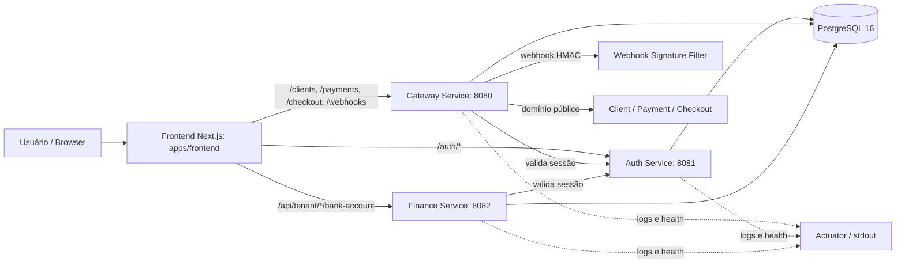

# Moonevue Monorepo

Plataforma modular para operação financeira, com frontend em Next.js e backend Java/Spring Boot dividido em serviços de autenticação, gateway e domínio financeiro. O objetivo do sistema é centralizar cadastro de contas, integração bancária, pagamentos e consultas de checkout em uma base reprodutível por Docker, com contratos HTTP claros e autenticação por sessão.

Este repositório foi organizado para reduzir retrabalho em onboarding, debugging e contribuições. A documentação abaixo explica a estrutura, como executar cada parte, quais variáveis de ambiente importam, onde estão os contratos e quais riscos ainda merecem atenção.

## Visão Geral

O sistema atende um fluxo financeiro multi-tenant: o usuário cria ou acessa um tenant, autentica por cookie HTTP-only, entra no dashboard do frontend e interage com contas bancárias, configurações de integração, clientes, transações e checkout. O frontend consome os serviços internos por rewrites do Next.js, enquanto o backend separa responsabilidade entre auth, gateway e finance.

O desenho favorece evolução gradual. O auth controla sessão e cookie, o gateway concentra a API pública e webhooks, e o finance mantém o domínio bancário e de contas. Isso permite evoluir a base com menos acoplamento e com mais rastreabilidade operacional.

## Arquitetura em Alto Nível



### Fluxo de requisição

1. O navegador abre o frontend em `http://localhost:3000`.
2. O frontend usa `fetch` com `credentials: include` e rewrites do Next para encaminhar chamadas para auth, gateway e finance.
3. O gateway valida cookie de sessão chamando `auth/introspect` e renova a sessão com `auth/touch` quando necessário.
4. O finance também valida sessão via filtro compartilhado e aplica autorização por tenant em parte dos endpoints.
5. Webhooks chegam em `/webhooks/banks/{provider}/events`, passam pelo filtro HMAC e recebem a autoridade interna `WEBHOOK`.

## Mapa do Repositório

| Pasta | Responsabilidade | Tecnologias principais |
| --- | --- | --- |
| `apps/frontend/` | Aplicação web, login, cadastro, dashboard, checkout e chamadas HTTP | Next.js 15, React 19, TypeScript, Ant Design, Tailwind 4 |
| `services/backend/` | Monorepo Maven com auth, gateway, finance e libs compartilhadas | Java 21, Spring Boot 3.5, Maven, Flyway, PostgreSQL |
| `services/backend/core/` | Entidades, repositórios, enums e filtros de sessão compartilhados | JPA, Spring Security, componentes de domínio |
| `services/backend/useful/` | Biblioteca auxiliar compartilhada | Utilitários internos |
| `.github/workflows/` | CI de frontend, CI de backend e release de imagens | GitHub Actions, Docker Buildx, GHCR |
| `docs/` | Documentação operacional e de arquitetura | Markdown |
| `docker-compose.yml` | Stack local completa | Docker Compose |
| `services/backend/docker-compose.yml` | Stack local do backend | Docker Compose |
| `services/backend/docker-compose.prod.yml` | Stack de produção/reprodução | Docker Compose |

### Módulos do backend

| Módulo | Papel | Observações |
| --- | --- | --- |
| `auth` | Registro, login, logout, introspecção e renovação de sessão | Expõe cookie `sid` e endpoints de administração interna |
| `gateway` | API pública, clientes, pagamentos, checkout e webhooks | Valida sessão via auth e assina webhooks via HMAC |
| `finance` | Contas bancárias e configurações bancárias | Valida tenant por sessão e armazena certificados |
| `core` | Entidades e filtros compartilhados | Base do modelo de domínio e segurança |
| `useful` | Utilidades comuns | Baixo acoplamento, apoio ao reactor Maven |

## Como Rodar (Local)

### Pré-requisitos

- Docker e Docker Compose.
- Node.js 20+ para comandos do frontend fora do container.
- Java 21 para comandos Maven locais.
- Git.

### Setup passo a passo

1. Copie os arquivos de ambiente:

```bash
cp .env.example .env
cp services/backend/.env.example services/backend/.env
```

2. Se for usar o frontend fora do Docker, ajuste `INTERNAL_API_BASE_URL`, `AUTH_INTERNAL_API_BASE_URL` e `FINANCE_INTERNAL_API_BASE_URL` para apontar para os serviços acessíveis nesse ambiente. Dentro do Docker Compose, os valores padrão já funcionam.

3. Suba a stack completa:

```bash
docker compose up --build
```

4. Acesse os serviços principais:

- Frontend: `http://localhost:3000`
- Gateway: `http://localhost:8080`
- Auth: `http://localhost:8081`
- Finance: `http://localhost:8082`

### Comandos principais

Na raiz do repositório:

```bash
npm install
npm run dev
npm run dev:backend
npm run dev:frontend
npm run lint:frontend
npm run build:frontend
```

No backend:

```bash
cd services/backend
./mvnw -B test
./mvnw -B -DskipTests package
```

### Execução por parte

- Frontend apenas: `npm run dev:frontend`
- Backend apenas: `npm run dev:backend`
- Backend isolado com compose próprio: `cd services/backend && docker compose up --build`
- Produção/reprodução do backend: `cd services/backend && docker compose -f docker-compose.prod.yml --env-file .env.prod up -d`

## Configuração (.env)

### Variáveis compartilhadas

| Variável | Uso |
| --- | --- |
| `TZ` | Fuso horário da stack |
| `POSTGRES_DB` | Nome do banco |
| `POSTGRES_USER` | Usuário do banco |
| `POSTGRES_PASSWORD` | Senha do banco |
| `SPRING_DATASOURCE_URL` | URL JDBC para os serviços Java |
| `SPRING_DATASOURCE_USERNAME` | Usuário JDBC |
| `SPRING_DATASOURCE_PASSWORD` | Senha JDBC |

### Auth

| Variável | Uso |
| --- | --- |
| `AUTH_BASE_URL` | Base interna do auth usada por gateway e finance |
| `AUTH_INTERNAL_TOKEN` | Token entre serviços para chamadas confiáveis |
| `AUTH_COOKIE_DOMAIN` | Domínio do cookie em ambiente real |
| `AUTH_COOKIE_SECURE` | `true` em produção |
| `AUTH_COOKIE_SAMESITE` | `Lax` ou `Strict` conforme o cenário |
| `AUTH_COOKIE_NAME` | Nome do cookie de sessão, padrão `sid` |
| `AUTH_COOKIE_MAX_AGE` | Tempo de vida da sessão em segundos |
| `AUTH_COOKIE_RENEW_THRESHOLD` | Limite para renovação da sessão |

### Gateway

| Variável | Uso |
| --- | --- |
| `WEBHOOK_HMAC_SECRET` | Segredo de assinatura dos webhooks |
| `STORAGE_CERTS_DIR` | Diretório de certificados bancários |
| `FRONTEND_URL` | URL pública para links e redirecionamentos |

### Frontend

| Variável | Uso |
| --- | --- |
| `NEXT_PUBLIC_API_BASE_URL` | Base pública para `fetch` no browser; pode ficar vazia com rewrites |
| `INTERNAL_API_BASE_URL` | Base interna usada pelas rewrites do Next para gateway |
| `AUTH_INTERNAL_API_BASE_URL` | Base interna do auth para rewrites do Next |
| `FINANCE_INTERNAL_API_BASE_URL` | Base interna do finance para rewrites do Next |

### Exemplo seguro

```bash
TZ=America/Sao_Paulo
POSTGRES_DB=moonevue
POSTGRES_USER=moonevue
POSTGRES_PASSWORD=troque-esta-senha
SPRING_DATASOURCE_URL=jdbc:postgresql://postgres:5432/moonevue
SPRING_DATASOURCE_USERNAME=moonevue
SPRING_DATASOURCE_PASSWORD=troque-esta-senha
AUTH_INTERNAL_TOKEN=troque-este-token
WEBHOOK_HMAC_SECRET=troque-este-hmac
AUTH_COOKIE_DOMAIN=localhost
AUTH_COOKIE_SECURE=false
AUTH_COOKIE_SAMESITE=Lax
```

## Testes e Qualidade

### Frontend

- Lint: `npm run lint:frontend`
- Build: `npm run build:frontend`
- O frontend não expõe suíte de testes automatizados no momento.

### Backend

- Testes: `cd services/backend && ./mvnw -B test`
- Package sem testes: `cd services/backend && ./mvnw -B -DskipTests package`

### Linters e formatadores

- Frontend usa ESLint via `apps/frontend/eslint.config.mjs`.
- Backend depende de Maven/Spring Boot e das convenções Java do projeto.
- Não há formatter centralizado documentado para o backend; siga o estilo atual.

## CI/CD

### Workflows existentes

| Workflow | Arquivo | O que faz |
| --- | --- | --- |
| Frontend CI | `.github/workflows/frontend-ci.yml` | Instala dependências, roda lint e build do frontend em push/PR com alterações em `apps/frontend/**` |
| Backend CI | `.github/workflows/backend-ci.yml` | Executa testes Maven, empacota os módulos e valida os Dockerfiles do gateway, auth e finance |
| Backend Release GHCR | `.github/workflows/backend-release-ghcr.yml` | Publica imagens Docker no GHCR para gateway, auth e finance em `main`, tags `v*` e `workflow_dispatch` |

### Ambientes

- `dev`: stack local com Docker Compose.
- `prod`: stack de produção/reprodução via `services/backend/docker-compose.prod.yml`.
- `release`: imagens publicadas em GHCR pelo workflow de backend.

### Versionamento e PR

- Branches sugeridas: `feat/*`, `fix/*`, `chore/*`.
- Prefira commits no estilo Conventional Commits quando possível.
- Pull requests devem trazer evidência de teste e impacto em API, banco ou ambiente.

## Observabilidade e Debug

### Logs

- Os serviços Java escrevem em stdout/stderr; acompanhe com `docker compose logs -f <serviço>`.
- O frontend usa a saída padrão do Next.js e do runtime do Node.
- Healthchecks de container usam `/actuator/health`.

### Endpoints de saúde

- `http://localhost:8080/actuator/health`
- `http://localhost:8081/actuator/health`
- `http://localhost:8082/actuator/health`

### Debug remoto

Os containers de desenvolvimento expõem portas JDWP:

- Gateway: `5005`
- Auth: `5007`
- Finance: `5006`

No backend isolado, os mesmos serviços também suportam debug pela porta interna `5005` dentro do container.

### Onde começar quando algo quebra

1. Verifique o estado dos containers: `docker compose ps`.
2. Leia os logs do serviço afetado.
3. Confirme variáveis de ambiente e disponibilidade do PostgreSQL.
4. Se o erro for de auth, verifique cookie, domínio e `AUTH_INTERNAL_TOKEN`.
5. Se o erro for de webhook, confirme HMAC e timestamp.

## Padrões de Código

- Frontend: App Router, componentes client only onde há estado, APIs centralizadas em `apps/frontend/lib/api`.
- Backend: separação por módulo Maven, controllers finos, serviços de domínio e filtros de segurança compartilhados.
- Contratos HTTP: DTOs explícitos e respostas com status HTTP apropriado.
- Sessão: cookie HTTP-only com renovação automática.
- Segurança: validação por tenant, token interno entre serviços e HMAC nos webhooks.

## Roadmap técnico curto

1. Adicionar testes automatizados no frontend e ampliar cobertura de integração no backend.
2. Gerar cliente HTTP a partir do OpenAPI para reduzir duplicação entre frontend e backend.
3. Evoluir observabilidade com métricas, tracing e logs estruturados centralizados.
4. Introduzir rate limiting e hardening adicional nos endpoints públicos e internos.
5. Revisar o fluxo de webhooks para suportar fila assíncrona e idempotência completa.

## Problemas conhecidos / Dívida técnica

### P0

Nenhum problema P0 foi confirmado nesta rodada de análise documental.

### P1

| Onde está | Impacto | Correção sugerida |
| --- | --- | --- |
| `services/backend/finance/src/main/java/com/moonevue/finance/controller/BankConfigurationController.java` | Os endpoints de configuração bancária não fazem a mesma checagem de tenant aplicada em `BankAccountController`, então um usuário autenticado pode tentar acessar configurações de outro tenant se souber os IDs | Aplicar a mesma guarda de tenant no controller ou centralizar a autorização na camada de serviço |
| `services/backend/auth/src/main/resources/application.yml`, `services/backend/gateway/src/main/resources/application.yml`, `services/backend/finance/src/main/resources/application.yml` | Os valores de fallback do datasource usam `moone_data_vue`; se o `.env` não estiver carregado, o boot tenta conectar com credenciais erradas e falha de forma pouco amigável | Corrigir o fallback e/ou falhar mais cedo com mensagem clara de configuração ausente |
| `apps/frontend/next.config.ts` e `package.json` | O frontend depende de rewrites para hostnames internos (`gateway`, `auth`, `finance`), então `npm run dev:frontend` fora da rede Docker não funciona sem override de ambiente | Documentar o modo local standalone ou adicionar perfis/variáveis para localhost |
| `services/backend/gateway/src/main/resources/db/migration/V1__create_audit_logs.sql` e `V2__create_audit_logs.sql` | Há duas migrations que criam a mesma tabela `audit_logs` com pequenas diferenças; isso aumenta risco de confusão e manutenção | Consolidar em uma única migration e manter ordem/versionamento consistente |

### P2

| Onde está | Impacto | Correção sugerida |
| --- | --- | --- |
| `apps/frontend/package.json` | Não há suíte de testes do frontend nem script `test`, então regressões de UI podem passar só com lint/build | Adicionar Vitest, Playwright ou ao menos testes de smoke |
| `apps/frontend/lib/api/*.ts` e controllers do backend | Os contratos HTTP estão duplicados entre frontend e backend; mudanças exigem atualização manual em dois lados | Gerar cliente e tipos a partir do OpenAPI ou criar um pacote de contratos compartilhado |
| `services/backend/auth/src/main/java/com/moonevue/auth/controller/AuthController.java` | `logout` é exposto via GET, o que é semanticamente frágil para uma operação que revoga sessão | Mudar para POST/DELETE e documentar o motivo caso mantenha GET |
| `services/backend/gateway/src/main/resources/application.yml` e `services/backend/finance/src/main/resources/application.yml` | O fallback de `SPRING_DATASOURCE_*` esconde configuração ausente em vez de deixar o erro explícito | Exigir variáveis obrigatórias em dev e documentar melhor o bootstrap |

## Como pedir mudanças para a IA

Quando pedir uma feature ou correção, inclua sempre:

1. O módulo afetado: `apps/frontend`, `services/backend/auth`, `services/backend/gateway` ou `services/backend/finance`.
2. O fluxo completo esperado: tela, endpoint, payload, status HTTP e comportamento de erro.
3. O ambiente de execução: Docker Compose, backend isolado ou frontend standalone.
4. Os critérios de aceite: o que deve funcionar e o que não pode quebrar.
5. Se houver risco de contrato, anexe exemplos de request/response e o caminho do arquivo que deve mudar.

Exemplo de pedido bom:

> Ajuste o fluxo de criação de conta bancária no frontend e no finance. Quando o usuário salvar, a lista deve recarregar, o endpoint deve continuar em `/api/tenant/{tenantId}/bank-account` e a autorização precisa continuar limitada ao tenant do cookie.

## Mapa do Projeto

- `apps/frontend`: interface web, login, register, dashboard e checkout.
- `services/backend/auth`: identidade, sessão, cookie e administração de usuários.
- `services/backend/gateway`: entrada pública, pagamentos, clientes, checkout e webhooks.
- `services/backend/finance`: contas bancárias, configurações bancárias e certificados.
- `services/backend/core`: entidades, enums, filtros e repositórios compartilhados.
- `docs`: decisões, runbook, fluxo de desenvolvimento e troubleshooting.

## Checklist de Saúde

- Build do frontend: `pendente de validação nesta execução`.
- Testes do backend: `pendente de validação nesta execução`.
- Lint do frontend: `pendente de validação nesta execução`.
- Docs principais: `atualizados nesta entrega`.
- Segurança mínima: `parcialmente atendida`, com cookie HTTP-only, HMAC em webhook e validação por tenant, mas ainda com gaps de autorização e hardening.
