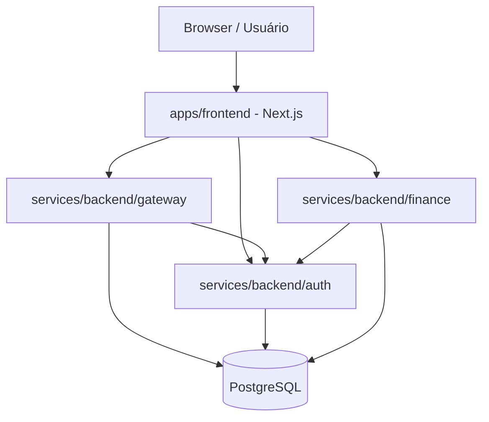

# Architecture

## Objetivo

Registrar as decisões estruturais do Moonevue para reduzir retrabalho em onboarding, revisão de PR e debugging. O desenho atual separa frontend, auth, gateway e finance em unidades independentes, com contratos HTTP explícitos e banco PostgreSQL compartilhado.

## Componentes

### Fronteiras de responsabilidade

- `apps/frontend`: experiência do usuário, estado de UI e chamada às APIs.
- `auth`: identidade, sessão, cookie e papéis.
- `gateway`: API pública, checkout, clientes, pagamentos e webhooks.
- `finance`: contas bancárias, configurações e certificados.
- `core`: modelo comum e segurança compartilhada.

## Request lifecycle

### Login / registro

1. O usuário envia o formulário no frontend.
2. O frontend chama `POST /auth/register` ou `POST /auth/login`.
3. O auth cria ou reutiliza sessão e devolve `Set-Cookie` com `sid`.
4. O frontend chama `GET /auth/introspect` e popula o contexto de autenticação.

### Requisições autenticadas

1. O browser envia o cookie `sid` com `credentials: include`.
2. O gateway ou finance aplica `SessionValidationFilter`.
3. O filtro chama `auth/introspect` com `X-Internal-Token`.
4. O Spring Security recebe uma autenticação interna com `tenantId`, `userId` e `roles`.
5. O controller executa a operação de domínio.

### Webhooks

1. O request entra em `POST /webhooks/banks/{provider}/events`.
2. O `WebhookSignatureFilter` calcula HMAC SHA-256 do corpo.
3. Se o header não bater, o request é recusado com 401.
4. Se bater, a autoridade `WEBHOOK` é adicionada à autenticação.
5. O controller processa o evento e pode usar idempotency key.

## Decisões técnicas

| Decisão | Motivo | Impacto |
| --- | --- | --- |
| Cookie HTTP-only para sessão | Reduz exposição do token no browser | Requer `credentials: include` e configuração correta de domínio |
| Introspecção via auth | Centraliza a fonte de verdade da sessão | Torna auth um ponto crítico de disponibilidade |
| Rewrites no Next.js | Simplifica o consumo das APIs no frontend | Exige atenção com hosts internos no modo standalone |
| PostgreSQL compartilhado | Simplifica a reprodução local e o TCC | Aumenta acoplamento operacional entre serviços |
| HMAC para webhook | Protege contra spoofing e replay básico | Exige gestão de segredo e clock confiável |

## Dados e ownership

- `auth_session` pertence ao auth.
- `users`, `tenants` e `roles` são gerenciados no auth/core.
- `bank_account` e `bank_configuration` pertencem ao finance.
- `clients`, `transactions` e eventos de checkout pertencem ao gateway.
- `audit_logs` existe nas migrations do gateway e deve ser tratada como um subsistema de trilha de auditoria, se/quando o código passar a usá-la.

## Integrações externas

- PostgreSQL 16.
- Provedor bancário do tipo EFI/PIX/Boleto, via abstração no gateway.
- GHCR para distribuição de imagens Docker do backend.

## Pontos de atenção

- Verifique se o fluxo de tenant está sempre validado no controller ou na camada de serviço.
- Confirme a estratégia de migrations por serviço antes de ativar novos schemas.
- Se for adicionar filas/eventos, mantenha idempotência nos consumidores.
- Se for abrir o frontend fora do Docker, ajuste os hosts internos usados nas rewrites.
